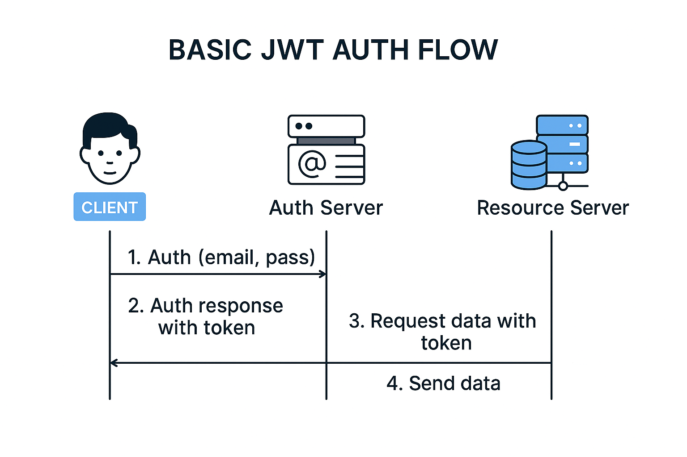

# JSON Web Token (JWT)

## 📦 Estrutura de um JWT

Um JWT é composto por três partes codificadas em Base64URL e separadas por pontos:

```
HEADER.PAYLOAD.SIGNATURE
```

### 1. **Header (Cabeçalho)**
Contém metadados sobre o token, como:
- `typ`: Tipo do token (geralmente `"JWT"`)
- `alg`: Algoritmo de assinatura (ex: `"HS256"`)

**Exemplo:**
```json
{
  "alg": "HS256",
  "typ": "JWT"
}
```

---

### 2. **Payload (Corpo)**
Inclui as informações sobre o usuário e as **claims** (declarações). Existem três tipos:

- **Públicas**: Acessíveis publicamente.
- **Registradas**: Claims padronizadas, como `sub`, `iat`, `iss`, etc.
- **Privadas**: Customizadas para a aplicação.

**Exemplo:**
```json
{
  "sub": "1234567890",
  "name": "Ali Mama",
  "admin": true,
  "iat": 1516230911
}
```

---

### 3. **Signature (Assinatura)**
Garante a integridade do token, impedindo alterações maliciosas.

**Exemplo de criação:**
```
HMACSHA256(
  base64UrlEncode(header) + "." + base64UrlEncode(payload),
  secret
)
```

---

## 🔐 Fluxo Básico de Autenticação com JWT



### Etapas:
1. **Autenticação**: O cliente envia e-mail e senha para o servidor de autenticação.
2. **Token JWT**: O servidor valida e responde com um JWT.
3. **Requisição**: O cliente envia o token junto nas requisições ao servidor de recursos.
4. **Resposta**: O servidor valida o token e envia os dados.

---

> Os JWTs simplificam a segurança entre cliente e servidor, garantindo **integridade** e **autenticidade** dos dados transmitidos.